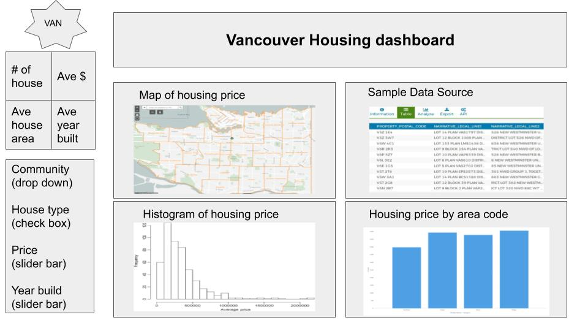

# Vancouver Housing Market Dashboard

-   Authors: Morris Zhao, Hanchen Wang, Ziyi Chen, Ken Wang

## Welcome

Thank you for being interested in our Vancouver Housing Market Dashboard!

Our dashboard is designed to provide an interactive and informative way to explore the Vancouver housing market. Whether you're a real estate professional, a data analyst, or simply curious about housing trends in Vancouver, our dashboard has something for you.

You may find information about the dashboard in this README file. To learn more about the features of our dashboard, jump to the sections below:

-   [What is this all about?](#motivation-and-purpose)
-   [About us](#who-are-we)
-   [How can you contribute?](#be-a-contributor)
-   [Keep in touch](#contact-us)
-   [Interested in more?](#more-information)
-   [Understand the jargon](#glossary)

We hope you find our dashboard useful and informative. Happy exploring!

## Summary

Our R-based dashboard application gives an easy way for people to explore housing prices in Vancouver city. More details can be found [here](reports/proposal.md).

## Motivation and purpose 

## Who are we 

## Be a contributor 

## Contact us 

## More information 

## Glossary

## Visualizations

-   **Map**: An interactive map that allows user to choose a certain area. Based on the area selection all other components will update in real time.
-   **Histogram**: Property price distribution. The range of price shown here is subject to the `Price` slide bar on the left. Price range and percentage show up when you hover over any bucket in the histogram. Optionally you can also change price range by drag-selecting areas within the current plot.
-   **Bar Chart**: You can either type in or use check boxes to select up to 5 area codes. Then the bar chart will show average property price for each region of interest.
-   **Data Table**: In addition to above visualizations, we also plan to include a `Data Source` component, where users can query and download the raw data as csv a file.

Ideally all the interactive features in these 4 visualizations are linked together. When you make a selection on one chart, all the other 3 will update accordingly as well.

## Navigation Pane

On the left hand side there are drop down menus, check boxes and slide bars to let you select data points under certain criteria. Currently our design is to let you filter by `community`, `property type`, `price` and `year built`. These filters will apply to all the 4 visualizations on the right.     

## Code of Conduct

Please note that the van_houses project is released with a [Contributor Code of Conduct](https://github.com/UBC-MDS/van_houses/blob/main/CODE_OF_CONDUCT.md). By contributing to this project, you agree to abide by its terms.

## Contributing

Interested in contributing? Check out the contributing guidelines. Please note that this project is released with a Code of Conduct. By contributing to this project, you agree to abide by its terms.

## License

Licensed under the terms of the MIT license.
